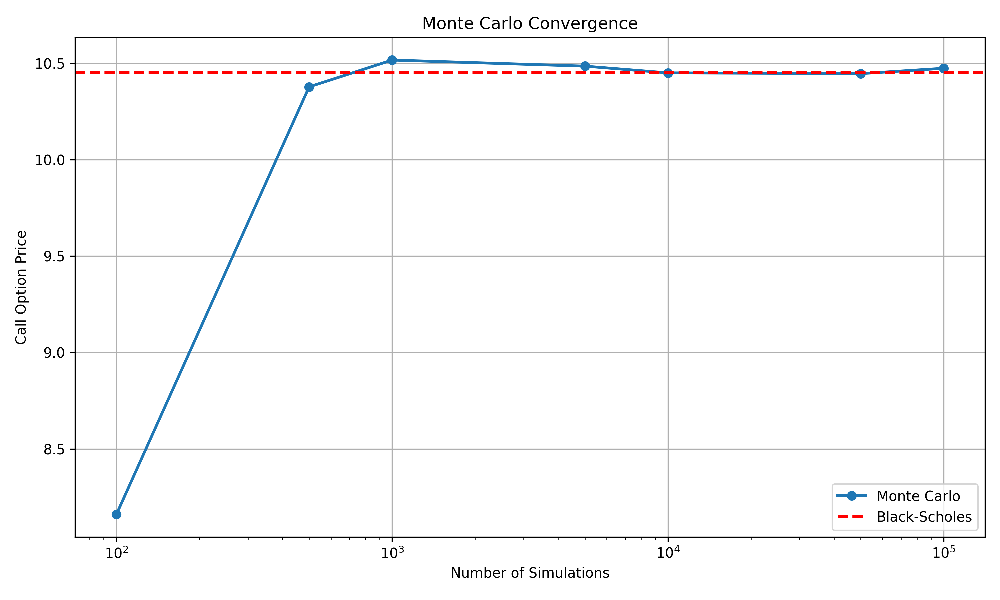

# Monte Carlo Option Pricing Engine

## Overview
A Python-based financial engineering project that prices European options using Monte Carlo simulations. The engine models asset paths under Geometric Brownian Motion (GBM) and validates the simulated prices against the analytical Black-Scholes-Merton model. 

This project was built to demonstrate core quantitative finance concepts, stochastic calculus applications, and object-oriented numerical programming in Python.

## Mathematical Background
The underlying asset is assumed to follow Geometric Brownian Motion (GBM):
dS = μS dt + σS dW
where W is a standard Wiener process (Brownian motion). 

The Monte Carlo engine simulates N possible future price paths to maturity T, calculates the payoff for each path, and discounts the average payoff back to present value at the risk-free rate.

## Features
* **Path Simulation:** Generates standard Brownian motion and standardizes variance.
* **Option Pricing:** Evaluates European Call and Put options.
* **Analytical Validation:** Compares Monte Carlo estimates directly with the Black-Scholes formula.
* **Convergence Analysis:** Tracks pricing error as a function of simulation count (Law of Large Numbers) with confidence intervals.

## Project Structure
Monte_Carlo_Project/
├── plots/               # Convergence and error visualization
├── src/                 
│   ├── brownian_motion.py
│   ├── gbm.py 
│   ├── option.py 
│   ├── monte_carlo.py 
│   ├── black_scholes.py 
│   └── experiments.py   # Simulation convergence logic
└── main.py              # Entry point for execution

## Usage
Run the main pricing engine:
python main.py

Run the convergence experiments to generate plots:
python src/experiments.py

## Results
*(Note: Upload your convergence.png and error.png to your GitHub repo, then link them here!)*

The plot above demonstrates the Monte Carlo price converging to the analytical Black-Scholes price as the number of simulations increases, verifying the implementation's accuracy.